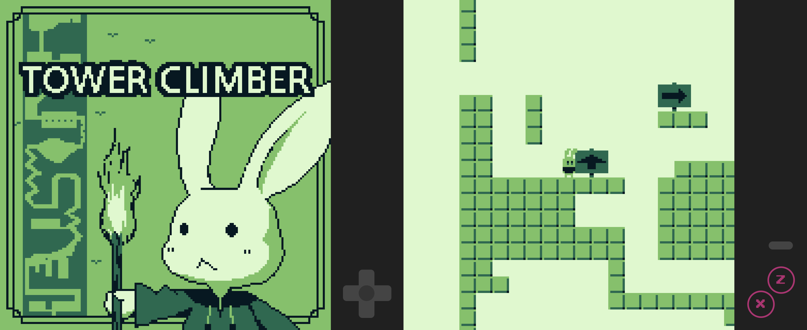

# towerclimber



A simple platformer game built on [wasm-4](https://wasm4.org/)

## Play

https://aratama.github.io/towerclimber

- Left and right button to move
- Up buton to look up
- Down button to crouch down or climb down a ladder
- Button1 to jump
- And more actions :)

## Development

### Run locally

```bash
$ w4 watch
```

### Release Build

Install wasm-snip:

```
$ cargo install wasm-snip
```

And:

```bash
$ ./build
```

### Notes

- Recommend wasm-snip for Rust wasm binaries https://github.com/aduros/wasm4/issues/238
